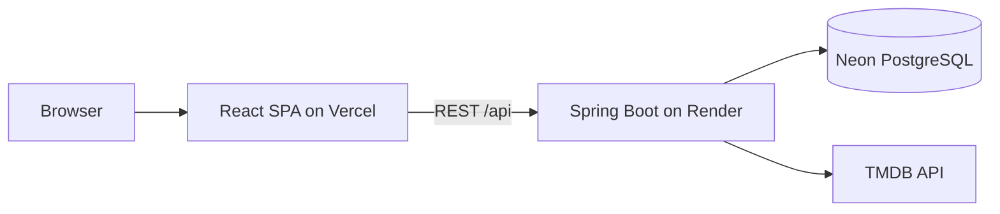

# CineCircle

Full-stack social movie platform: discover films via TMDB, track watchlists and watched history, rate and review movies, follow users, and stay updated with a personalized feed and notifications.

**Live demo:** [cinecircle-three.vercel.app](https://cinecircle-three.vercel.app) · **GitHub:** [github.com/yashchat007/CineCircle](https://github.com/yashchat007/CineCircle)

> Movie data and images are provided by [TMDB](https://www.themoviedb.org/). This product uses the TMDB API but is not endorsed or certified by TMDB.

---

## Key features

- **Accounts** — Register and log in, JWT-based authentication, profiles and settings
- **Discovery** — Search and browse (popular, top rated, now playing, upcoming); movie details; genre-based “For You” recommendations
- **Tracking** — Watchlist, watched history, per-movie status
- **Reviews & social** — 1–5 star ratings, reviews, likes, comments, follow users, activity feed
- **Lists** — Custom movie lists on profiles
- **Notifications** — Followers, likes, comments, and reviews from people you follow

---

## Tech stack

| | |
|---|---|
| **Frontend** | React 19, TypeScript, Vite, Tailwind CSS, React Router |
| **Backend** | Java 21, Spring Boot 3, Spring Security (JWT), Spring Data JPA, Maven |
| **Database** | H2 (local dev), PostgreSQL / Neon (production) |
| **External API** | TMDB (server-side only) |
| **Tooling** | Docker Compose, JUnit, Mockito |

---

## Architecture



In production, the Vercel app serves the SPA and proxies `/api` to the backend. Locally, Vite proxies `/api` to Spring Boot on port 8080. TMDB supplies movie metadata; users, reviews, social data, lists, and notifications live in the application database.

---

## Project structure

```text
CineCircle/
├── backend/          # Spring Boot REST API
├── frontend/         # React SPA (Vite)
├── docker-compose.yml
└── README.md
```

---

## Local setup

**Prerequisites:** Java 21, Maven, Node.js, and a TMDB API read token (backend only — never commit it).

**Backend** (H2 file database; no local PostgreSQL required):

```powershell
cd backend
copy .env.example .env
# Add TMDB_API_TOKEN to .env
.\run-local.ps1
```

**Frontend:**

```powershell
cd frontend
npm install
npm run dev
```

Open [http://localhost:5173](http://localhost:5173).

Optional: run `docker compose up --build` from the repo root for a full stack with PostgreSQL (set required secrets in your environment first).

---

## Environment variables

**Do not commit `.env` files or expose secrets** (tokens, passwords, JWT keys, or database credentials) in the repo, client bundle, or screenshots.

| Variable | Purpose |
|----------|---------|
| `TMDB_API_TOKEN` | TMDB movie data (backend only) |
| `JWT_SECRET` | Signs JWTs (required in production) |
| `JWT_EXPIRATION_HOURS` | Token lifetime (optional) |
| `DATABASE_URL` | JDBC URL for PostgreSQL |
| `DATABASE_USERNAME` | Database user |
| `DATABASE_PASSWORD` | Database password |
| `CORS_ALLOWED_ORIGINS` | Allowed frontend origins for the API |
| `SPRING_PROFILES_ACTIVE` | e.g. `prod` on hosted backend |
| `PORT` | HTTP port (often set by the host) |
| `TMDB_BASE_URL` | TMDB API base URL (optional override) |
| `VITE_API_BASE_URL` | Backend URL for split hosting; leave unset for local Vite proxy and Vercel |

Templates: `backend/.env.example`, `frontend/.env.example`.

---

## Testing

```powershell
cd backend
mvn test
```

```powershell
cd frontend
npm run build
```

---

## Deployment

| Layer | Platform |
|-------|----------|
| Frontend | Vercel |
| Backend | Render |
| Database | Neon PostgreSQL |

Configure secrets on each platform via environment variables. The TMDB token stays on the backend only.

---

## Author

**[Yash](https://github.com/yashchat007)** — [CineCircle](https://github.com/yashchat007/CineCircle)
