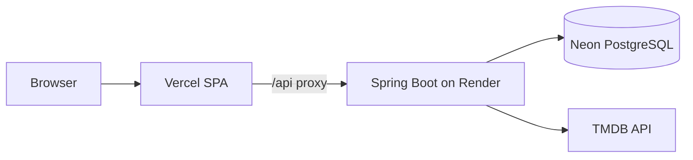

# CineCircle

**CineCircle** is a full-stack social movie platform: discover films via [TMDB](https://www.themoviedb.org/), track what you watch, rate and review movies, follow other users, and stay updated through a personalized feed and notifications.

**Live app:** [https://cinecircle-three.vercel.app](https://cinecircle-three.vercel.app)  
**API (Render):** [https://cinecircle-qy7e.onrender.com](https://cinecircle-qy7e.onrender.com)  
**Repository:** [https://github.com/yashchat007/CineCircle](https://github.com/yashchat007/CineCircle)

> Movie data and images are provided by TMDB. This product uses the TMDB API but is not endorsed or certified by TMDB.

---

## Table of contents

- [Features](#features)
- [Tech stack](#tech-stack)
- [Architecture](#architecture)
- [Project structure](#project-structure)
- [Prerequisites](#prerequisites)
- [Local development](#local-development)
- [Environment variables](#environment-variables)
- [API overview](#api-overview)
- [Database](#database)
- [Testing](#testing)
- [Docker Compose](#docker-compose)
- [Deployment](#deployment)
- [Demo & screenshots](#demo--screenshots)
- [Future improvements](#future-improvements)
- [License & author](#license--author)

---

## Features

### Authentication & profiles

- Register, log in, and log out
- JWT-based sessions (stateless API)
- BCrypt password hashing
- Protected routes on the frontend
- Public profiles (`/u/:username`) with display name and bio
- Account settings (update profile)

### Movie discovery

- Search movies by title with optional year filter
- Browse TMDB categories: Popular, Top Rated, Now Playing, Upcoming
- Movie detail pages (poster, backdrop, overview, genres, runtime, TMDB rating, community rating)
- Personalized **For You** recommendations from your watched/reviewed genres (no ML pipeline)

### Tracking

- Watchlist and watched history
- Marking a movie as watched removes it from the watchlist
- Per-movie status on detail pages

### Reviews & social

- Rate movies (1–5 stars) and write reviews; edit or delete your own
- Like/unlike reviews and comment on reviews (edit/delete own comments)
- Follow and unfollow users; search users by username or display name
- Activity **Feed** from people you follow (reviews and lists)
- In-app **notifications** (new followers, likes, comments, reviews from followed users)

### Lists

- Create named movie lists with optional descriptions
- Add/remove movies; view your lists and other users’ public lists

---

## Tech stack

| Layer | Technologies |
|--------|----------------|
| **Frontend** | React 19, TypeScript, Vite 8, Tailwind CSS 4, React Router 7 |
| **Backend** | Java 21, Spring Boot 3.5, Spring Security (JWT resource server), Spring Data JPA, Jakarta Validation, Maven |
| **Database** | H2 (local dev via `run-local.ps1`), PostgreSQL (production / Docker) |
| **External API** | TMDB (movie metadata and images; token stays on the server) |
| **Testing** | JUnit 5, Spring Boot Test, Mockito, H2 (integration tests) |

---

## Architecture

Monolithic Spring Boot REST API with a separate React SPA. The browser talks to `/api/*`; in production on Vercel, those requests are proxied to the Render backend so auth calls stay same-origin.



**Local development:** Vite dev server on port `5173` proxies `/api` to `http://localhost:8080`.

---

## Project structure

```text
CineCircle/
├── backend/                 # Spring Boot API
│   ├── src/main/java/       # Controllers, services, domain, security
│   ├── src/main/resources/  # application.yml, application-prod.yml
│   ├── run-local.ps1        # Local run with file-based H2 (no PostgreSQL required)
│   ├── Dockerfile
│   └── .env.example
├── frontend/                # React SPA
│   ├── src/                 # pages, components, api client
│   ├── vercel.json          # SPA rewrites + /api proxy to Render
│   ├── Dockerfile           # nginx static build
│   └── .env.example
├── docker-compose.yml       # PostgreSQL + backend + frontend
└── README.md
```

---

## Prerequisites

- **Java 21** and **Maven** (backend)
- **Node.js 20+** and **npm** (frontend)
- **TMDB API Read Access Token** — create at [TMDB API settings](https://www.themoviedb.org/settings/api) (backend only; never commit it)

Optional: **Docker** and **Docker Compose** for a full stack with PostgreSQL.

---

## Local development

### 1. Backend (H2 file database)

No PostgreSQL is required for day-to-day local work.

```powershell
cd backend
copy .env.example .env
# Edit .env and set TMDB_API_TOKEN=your_token
.\run-local.ps1
```

The API listens on **http://localhost:8080**. Data is stored under `backend/.localdb/` (git-ignored).

### 2. Frontend

```powershell
cd frontend
npm install
npm run dev
```

Open **http://localhost:5173**. The Vite dev server proxies `/api` to the backend.

### 3. Production-like local stack (PostgreSQL)

Use Docker Compose (see [Docker Compose](#docker-compose)) or point the backend at a local PostgreSQL instance using `DATABASE_*` variables in `backend/.env`.

---

## Environment variables

### Backend (`backend/.env` or host env)

| Variable | Required | Description |
|----------|----------|-------------|
| `TMDB_API_TOKEN` | Yes (for movie features) | TMDB read access token; server-side only |
| `JWT_SECRET` | Prod: yes; local: optional | At least 32 characters; prod profile has no default |
| `JWT_EXPIRATION_HOURS` | No | Default `168` (7 days) |
| `DATABASE_URL` | Prod / Docker | JDBC URL, e.g. `jdbc:postgresql://host:5432/dbname?sslmode=require` |
| `DATABASE_USERNAME` | Prod / Docker | PostgreSQL user |
| `DATABASE_PASSWORD` | Prod / Docker | PostgreSQL password |
| `CORS_ALLOWED_ORIGINS` | Prod | Comma-separated frontend origins (e.g. `https://cinecircle-three.vercel.app`) |
| `SPRING_PROFILES_ACTIVE` | Prod | Set to `prod` on Render |
| `PORT` | Render | Provided by Render; Spring uses `${PORT:8080}` |
| `JPA_DDL_AUTO` | No | Default `update` in prod; use `validate` once schema is stable |
| `TMDB_BASE_URL` | No | Default `https://api.themoviedb.org/3` |

Copy from `backend/.env.example`. Never commit `.env` files.

**Neon PostgreSQL:** use a JDBC URL with TLS, for example:

`jdbc:postgresql://<host>/<database>?sslmode=require`

Set username and password via `DATABASE_USERNAME` and `DATABASE_PASSWORD` (recommended for Spring), not only embedded in the URL.

### Frontend (`frontend/.env`)

| Variable | When | Description |
|----------|------|-------------|
| `VITE_API_BASE_URL` | Docker / split hosting | Backend origin without trailing slash |

Leave **unset** for:

- **Local dev** — Vite proxy handles `/api`
- **Vercel** — the app uses same-origin `/api`; `vercel.json` proxies to Render

---

## API overview

All JSON endpoints are under `/api`. Authenticated routes expect:

`Authorization: Bearer <jwt>`

Public routes include registration, login, and read-only movie browse/search/details where implemented without auth.

| Area | Base path | Examples |
|------|-----------|----------|
| Auth | `/api/auth` | `POST /register`, `POST /login` |
| Users | `/api/users` | `GET /me`, `PUT /me`, `GET /{username}`, follow/unfollow |
| Movies | `/api/movies` | `GET /search`, `GET /browse`, `GET /{tmdbId}`, `GET /recommendations` |
| Reviews | `/api/movies/{tmdbId}` | `PUT /review`, `DELETE /review`, `GET /reviews` |
| Reviews (global) | `/api/reviews` | `GET /recent` |
| Social | `/api/reviews/{reviewId}` | like, comments CRUD |
| Tracking | `/api/me` | watchlist, watched, movie status |
| Lists | `/api/me/lists`, `/api/users/{username}/lists` | CRUD lists and list movies |
| Feed | `/api/feed` | Following activity |
| Notifications | `/api/notifications` | list, unread count, mark read |

Errors return JSON with `message` and optional `fieldErrors` (handled by the frontend API client).

---

## Database

- **Local (`run-local.ps1`):** H2 file database in PostgreSQL compatibility mode; schema managed with `ddl-auto=update`.
- **Production:** PostgreSQL (e.g. Neon). Hibernate `ddl-auto=update` on first deploy; consider `JPA_DDL_AUTO=validate` after the schema is established.
- **Tests:** In-memory H2 (`backend/src/test/resources/application.yml`).

Domain data (users, reviews, follows, lists, notifications, etc.) lives in PostgreSQL/H2. Movie catalog content is fetched from TMDB on demand and is not stored as a full mirror.

---

## Testing

```powershell
cd backend
mvn test
```

Integration tests cover core user journeys (auth, movies, tracking, reviews, social, lists, feed). The frontend build is type-checked via `npm run build` (`tsc && vite build`).

---

## Docker Compose

From the repository root, set secrets and start the stack:

```powershell
$env:JWT_SECRET = "your-long-random-secret-at-least-32-chars"
$env:TMDB_API_TOKEN = "your_tmdb_token"
docker compose up --build
```

| Service | URL |
|---------|-----|
| Frontend (nginx) | http://localhost |
| Backend | http://localhost:8080 |
| PostgreSQL | localhost:5432 (`cinecircle` / `cinecircle`) |

The frontend image is built with `VITE_API_BASE_URL=http://localhost:8080`.

---

## Deployment

Current production layout:

| Component | Platform | Notes |
|-----------|----------|--------|
| Frontend | [Vercel](https://cinecircle-three.vercel.app) | Root directory: **`frontend`**; `vercel.json` rewrites SPA routes and proxies `/api/*` to Render |
| Backend | [Render](https://cinecircle-qy7e.onrender.com) | Root directory: **`backend`**; **Docker** runtime (`backend/Dockerfile`) |
| Database | [Neon](https://neon.tech) | PostgreSQL; JDBC URL with `sslmode=require` |

### Render (backend)

1. Web service from this repo, root **`backend`**, Docker.
2. Environment (minimum):
   - `SPRING_PROFILES_ACTIVE=prod`
   - `JWT_SECRET` (≥ 32 characters)
   - `TMDB_API_TOKEN`
   - `DATABASE_URL`, `DATABASE_USERNAME`, `DATABASE_PASSWORD`
   - `CORS_ALLOWED_ORIGINS=https://cinecircle-three.vercel.app`
3. Render sets `PORT`; the app binds to `0.0.0.0` and `${PORT:8080}`.

### Vercel (frontend)

1. Project root **`frontend`**, framework **Vite**.
2. Leave `VITE_API_BASE_URL` unset so the client uses same-origin `/api`.
3. Update the proxy target in `frontend/vercel.json` if the Render service URL changes.

### Secrets

- Store TMDB and JWT secrets only in environment variables or git-ignored `.env` files.
- Do not expose `TMDB_API_TOKEN` to the frontend build.

---

## Demo & screenshots

- **Try the app:** [https://cinecircle-three.vercel.app](https://cinecircle-three.vercel.app)
- Create an account, search or browse movies, add to watchlist, write a review, follow another user, and open the feed/notifications.

Screenshots are not checked into the repo yet. To add them later, create a `docs/screenshots/` folder and link images here (Discover, Movie detail, Feed, Profile).

---

## Future improvements

Possible next steps (not in the current scope):

- Email verification and password reset
- Pagination and caching tuning for high-traffic browse/search
- Stricter production schema management (Flyway/Liquibase, `ddl-auto=validate`)
- Rate limiting and abuse protection on auth and write endpoints
- Configurable API base URL in `vercel.json` via deployment documentation or build-time env
- Expanded accessibility and E2E test coverage

---

## License & author

Built by [yashchat007](https://github.com/yashchat007).

Add a `LICENSE` file in the repository if you intend to open-source under a specific license.
